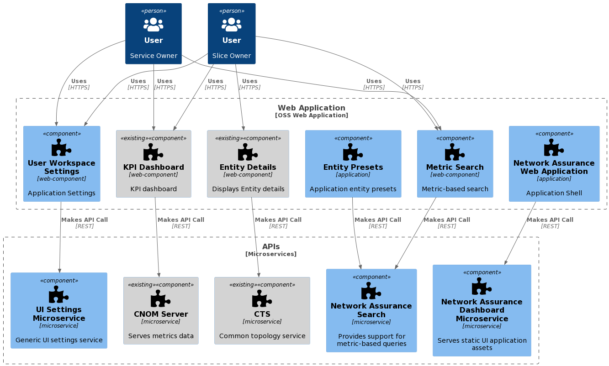

# Network Assurance Search Service User Guide

> **_NOTE:_** the "Network Assurance Dashboard" application has been renamed as "Service Assurance Dashboard"

[TOC]

## **Overview**

This document provides an overview of the Network Assurance Search Microservice. It gives a brief description of its
main features and its interfaces.

The Network Assurance Search Microservice is intended to interface the Assurance Indexer Service. It is a micro-frontend
and corresponding backend
that will display a pageable, sortable, and filterable table view of data stored by the Assurance Indexer. It can be
used in a few different ways, such
as:

- Clients can use this service to explore whether the functions in their network are operating within their expectations
  of their
  SLSs/SLAs. The service accomplishes this by exposing different levels of aggregated performance metrics from functions
  in the network. It allows the
  user to filter, drill down, and perform other actions to visualize more information (ex. time series charts and
  configuration details) to
  support the user in building this understanding so they can use their discoveries to troubleshoot their networks.

The Network Assurance Search Microservice provides a convenient REST API for querying KPI data and exposing search
results via the Assurance Indexer
Service. It will also provide any required data augmentation.

## **Revision History**

| Date       | Revision | Comment                  | Author             |
| ---------- | -------- | ------------------------ | ------------------ |
| 2024-02-08 | 1.0.3    | Update guide with customization section and remove refs to help aggregator | Megan Robertson |
| 2023-09-26 | 1.0.2    | Update user guide        | Ajay Borkar        |
| 2023-06-27 | 1.0.1    | Deployment guide publish | Sriharsha Kosaraju |
| 2023-04-26 | 1.0.0    | Initial publish          | Jeremy Levasseur   |

## **Supported Use Cases**

The following table lists the supported use cases of Network Assurance Search.

| Use Case ID | Use Case Title                                    | Compliance      |
| ----------- |---------------------------------------------------| --------------- |
| 1           | Able to search for entities' KPIs using filters.  | Fully Supported |
| 2           | Include filtering by date range.                  | Fully Supported |
| 3           | Include filtering by conditional values.          | Fully Supported |
| 4           | Able to search by groups of entities.             | Fully Supported |
| 5           | Able to display results in pages (pagination).    | Fully Supported |
| 6           | Able to view the results sorted.                  | Fully Supported |
| 7           | Able to view specific result fields.              | Fully Supported |

## **Architecture View**

The following figure shows the architecture view of the Network Assurance Search.



See [ESOA Service Assurance 2.0](https://confluence-oss.seli.wh.rnd.internal.ericsson.com/pages/viewpage.action?spaceKey=CENX&title=ESOA+Service+Assurance+2.0)
 for more details.

### Basic flow for NAS is as follows

- Assurance Indexer Service consumes topology via CTS API
- Assurance Indexer Service sources its data to Network Assurance Dashboard Microservice and PM Stats Query Service
- CNOM Server consumes PM data via new configuration-based Data Source
- Network Assurance Dashboard Microservice is UI microservice discovered by GUI Aggregator and serves static application resources.
- Metric Search Component makes search request to Network Assurance Search Microservice
- Components interact with each other over the event bus
- Network Assurance Web Application consuming ADP services for translation, logging, notification, setting, etc.
- User Workspaces Component is built on top of UI Settings Service and responsible to maintaining application configuration
- Network Assurance Search Microservice is responsible for providing search service and data introspection services used by Entity Presets Component
- CTS API is consumed by Entity Details Component (existing components)
- KPI Dashboard is backed up by CNOM Server (existing components)

## **Interfaces and Connections**

### **Provided Application Programming Interfaces (APIs)**

| Interface Logical Name | Interface Realization  | Description                                                                                                                                                | Interface Maturity |
| ---------------------- | ---------------------- | ---------------------------------------------------------------------------------------------------------------------------------------------------------- | ------------------ |
| Search API             | _Link To OpenAPI Spec_ | This interface provides access to the data that is stored within opensearch by the Assurance Indexer                                                       | Alpha              |
| Metadata API           | _Link To OpenAPI Spec_ | This interface provides access to data used to create the search documents and configure the Network Assurance Web Application from the Assurance Indexer. | Alpha              |

### Network assurance search UI

The Network assurance search UI displays the assurance dashboard.

The UI is served by the assurance search backend, and can be accessed through Ingress on the `/ui/` path.

### **Consumed Interfaces**

| Interface                  | Description                                                             |
| -------------------------- | ----------------------------------------------------------------------- |
| Kubernetes API (HTTP/REST) | Used to discover services hosting GUI applications. (API version: 1.22) |
| FM                         | Used for sending Fault Indications (via FI REST Interface)              |
| SIP-TLS                    | Consuming TLS certificates (via K8s file mount)                         |
| Log Transformer            | Used for sending logs to ADP Log Transformer (via Syslog)               |
| Helm Configuration         | Configuration parameters (via Helm via K8s file mount)                  |

## **Dimensioning and Characteristics**

### **Dimensioning**

To handle dimensioning configuration at deployment time, refer to the [Deployment](#deployment) section.

### **Scaling**

Network Assurance Search is stateless and supports scaling. It supports manual scaling only.

The following table contains scaling details for Network Assurance Search.

| Scaling Supported (Yes/No) | Minimum Number of Instances | Maximum Number of Recommended Instances |
| -------------------------- | --------------------------- | --------------------------------------- |
| Yes                        | 0 (Default is 2)            | 20                                      |

Here is an example of executing the `kubectl` command to scale:

```bash
kubectl -n nas-deployment-namespace scale --replicas=3 deployment nas-deployment
```

### **Resilience**

- Network Assurance Search provides High Availability(HA) through multiple instances. Once Network Assurance search
  instance fails,
  association reestablishment shall be initiated to other instances.
- For service stability monitoring, Network Assurance Search provides Liveness and Readiness probes used by Kubernetes
  container orchestration engine.

### **High Availability**

The Network Assurance Search service supports high availability by changing values.yaml:

Step 1: Run multiple instances of microservices which are horizontally scalable (replicaCount default value >= 2).

```text
replicaCount may be changed on the command line for 'helm deploy' or in values.yaml:
    replicaCount: 2
```

Step 2: Set pod anti-affinity rule (default = preferredDuringScheduling,IgnoredDuringExecution or soft)

```text
affinity:
  podAntiAffinity: "soft"
```

Step 3: Support setting of topology spread constraints (default = undefined) via value.yaml to help schedule pods across user defined topologies.

```text
nodeSelector: { }
topologySpreadConstraints:
  deployment: [ ]
  test: [ ]
```

Step 4: QOS config for pod eviction policy due to resource issues on node - Guaranteed, Burstable or BestEffort.
This is accomplished in spec containers.

```text
status:
    qosclass: Burstable
```

Step 5: Configure mandatory health probes - liveness (with appropriate InitialDelaySeconds) and readiness.

```text
probes:
    assurancesearch:
        livenessProbe:
            initialDelaySeconds: 300
            periodSeconds: 5
            timeoutSeconds: 2
            failureThreshold: 3
        readinessProbe:
            initialDelaySeconds: 30
            periodSeconds: 5
            timeoutSeconds: 2
            failureThreshold: 3
```

### **Upgrade - In Service Software Upgrade**

Network Assurance Search supports in-service upgrade without loss of data or service downtime by providing Rolling
Update and having multiple Replicates.

When a new Network Assurance Search release is successfully upgraded, the new configuration starts to work, as may free
some resources.

Upgrades are supported through Helm upgrades. Configuration files are checked
for changes and reloaded as they change. The UI might be unavailable during
the Helm upgrade process.

**Note:**
If any chart value is customized at upgrade time through the
`--set` option of the `helm upgrade` command, all other previously customized
values will be replaced with the ones included in the new version of the Helm chart.
To make sure that any customized values are preserved as part of the
upgrade, store a versioned list of the custom values. Such a list can be
provided as input to the upgrade command to use the `--set`
option without unintended changes to custom values.

## **Deployment**

Network Assurance Search can be installed in the selected Kubernetes cluster with [Helm](https://helm.sh/) Charts.
These instructions are valid for Ericsson-internal users using Helm v3.

Step 1: To be able to pull or push the Network Assurance Search Helm chart, generate an API Key
from the [SELI Artifactory](https://arm.seli.gic.ericsson.se/artifactory/webapp/#/home).

1. Log in.
2. Click your username.
3. Click **Edit Profile**.
4. Unlock the settings by entering the password.
5. Copy the API Key.

**Note:** Alternatively, the encrypted password can be used, but it can expire.

Step 2: Add the Helm repository as `proj-eric-oss` and refresh the repository list locally.

```bash
helm repo add proj-eric-oss https://arm.seli.gic.ericsson.se/artifactory/proj-eric-oss \
  --username $DOCKER_USERNAME \
  --password $DOCKER_PASSWORD
helm repo update
```

Step 3: Create a pull secret for ARM in the namespace where the service will be installed.

**Note:** The `--namespace=<namespace>` parameter is optional for the following commands.
Add this parameter if the service must be installed to a different namespace
from what is defined in the current `kubectl` context.

```bash
  kubectl create secret docker-registry arm-pullsecret \
    --docker-server=armdocker.rnd.ericsson.se \
    --docker-username=<USERNAME> \
    --docker-password=<ARTIFACTORY_API_KEY_SELI> \
    --namespace=<namespace>
```

Step 4: Install the service.

It can be installed from the repo

```bash
helm install eric-oss-network-assurance-search \
  proj-eric-oss/eric-oss-network-assurance-search \
  --set global.pullSecret=arm-pullsecret \
  --namespace=<namespace>
```

Step 5: Access Assurance search UI with port forward.

```bash
kubectl port-forward svc/eric-oss-network-assurance-search-http 3000
```

Step 6: Open `http://localhost:3000/ui` in a web browser to access the Assurance search web application.

**Note:** The UI is using
[EUISDK](https://euisdk.seli.wh.rnd.internal.ericsson.com/showcase/esm-docs/#welcome),
which officially supports the latest version of the following browsers:

- Mozilla Firefox Extended Support Release (ESR)
- Google Chrome
- Safari
- Microsoft Edge (Chromium)

Older browser versions might incorrectly display the GUI.

### Verify the Availability of Network Assurance Search

To verify that the deployment is successful:

Step 1: Check if the Helm Chart is installed with the provided release name and
in the correct namespace.

```bash
helm ls <namespace>
```

**Result:** The Chart status is `DEPLOYED`.

Step 2: Verify the status of the deployed Helm Chart.

```bash
helm status <release_name>
```

**Result:** The Chart status is `DEPLOYED`. The status of all Pods is
`Running`, and the number of Deployment Available must be the
same as the replica count.

Step 3: Verify that the Pods are running.

```bash
kubectl get pods --namespace=<namespace>
```

**Result:** The statuses of all Pods are `Running`. All containers in any pod must
be reported as `Ready`.

### **Prerequisites**

The following prerequisites must be met before the deployment of Network Assurance Search:

- A running Kubernetes environment with Helm support
- Knowledge of the Kubernetes environment, including the networking details, and access rights to deploy and manage
  workloads
- Availability of the kubectl CLI tool with correct authentication details
  - Note: Contact the Kubernetes System Administrator if necessary
- Availability of Helm charts and Docker images for the service and all dependent services

### **Custom Resource Definition (CRD) Deployment**

Custom Resource Definitions (CRD) are cluster-wide resources which must be installed prior to the Generic Service
deployment. The service that
requires the latest CRD charts version set which CRD charts version to use in the deployment.

> Note: The release name chosen for the CRD charts in the K8s deployment must be kept and cannot be changed later.

Helm ALWAYS requires a namespace to deploy a chart and the namespace to be used for the same per-service CRDs chart must
be created before
the CRDs charts are loaded.

> Note: The upgrade of the CRDs must be done before deploying a service that requires additional CRDs or a CRD version
> newer than the one already deployed on the K8s cluster.

The CRD chart is deployed as follows:

Step 1: Download the latest applicable CRD charts files from the helm charts
repository.

Step 2: If the `namespace` does not already exist, create the `namespace` where the CRD charts will be deployed.
This step is only done once on the Kubernetes cluster.

```bash
kubectl create namespace <NAMESPACE-FOR-CRDs>
```

Step 3: Deploy the CRD using `helm upgrade` command:

```bash
helm upgrade --install --atomic <release name> <CRD chart with version> --namespace <NAMESPACE-FOR-CRDs>
```

Step 4: Validate the CRD installation with the `helm ls` command:

```bash
helm ls -a
```

In the table, locate the entry for the `<release name>`, validate the
`NAMESPACE` value, and check that the STATUS is set to `deployed`.
When the output is validated, continue with the installation of the helm charts.

### **Deployment in a Kubernetes Environment Using Helm**

This section describes how to deploy the service in Kubernetes using Helm and the kubectl CLI client.
Helm is a package manager for Kubernetes that streamlines the installation and management of Kubernetes applications.

#### **Preparation**

Prepare helm chart and docker images. Helm chart in the following link can be used for installation:

[Helm Chart Package](https://arm.seli.gic.ericsson.se/artifactory/proj-eric-oss-drop-helm/eric-oss-network-assurance-search/),

#### **Pre-Deployment Checks for Network Assurance Search Microservice**

Ensure the following:

- The release name is not used already in the corresponding cluster. Use `helm list -n <namespace>`
  command to list the existing deployments (and delete previous deployment with the corresponding release name if needed).

- The same namespace is used for all deployments.

- A secret containing Armdocker registry login credentials exists.

  ```bash
  kubectl create secret docker-registry <SECRET_NAME> \
    --docker-username="${SELI_ARTIFACTORY_REPO_USER}" \
    --docker-password="${SELI_ARTIFACTORY_REPO_PASS}" \
    --docker-server=https://armdocker.rnd.ericsson.se/ \
    --namespace="${NAMESPACE}"
  ```

#### **Helm Chart Installations of Dependent Services**

- Install the Assurance Indexer Service - Please refer to
  [Assurance Indexer Service User Guide's Deployment Section](https://adp.ericsson.se/marketplace/assurance-indexer/documentation/development/additional-documents/user-guide#deployment)

- Install the Search Engine Service - Please refer to
  [Search Engine Service User Guide's Deployment Section](https://adp.ericsson.se/marketplace/search-engine/documentation/12.8.0/dpi/service-user-guide#deployment)

- Install the CNOM Server Service - Please refer to
  [CNOM Server Service User Guide's Deployment Section](https://adp.ericsson.se/marketplace/cnom-server/documentation/2.10.3/dpi/service-user-guide#deployment)

- Install the PM Stats Query Service - Please refer to
  [PM Stats Query Service User Guide's Deployment Section](https://adp.ericsson.se/marketplace/pm-stats-query-service/documentation/development/dpi/service-user-guide#deployment)

#### **Helm Chart Installation of Network Assurance Search Microservice Service**

> Note: Ensure all dependent services are deployed and healthy before you continue with this step (see previous
> chapter).

Helm is a tool that streamlines installing and managing Kubernetes applications. Network Assurance Search Microservice
can be deployed
on Kubernetes using Helm Charts. Charts are packages of pre-configured Kubernetes resources.

Users can override the default values provided in the values.yaml template of the helm chart.
The recommended parameters to override are listed in the following section: : [Configuration Parameters](#configuration-parameters).

#### **Deploy the Network Assurance Search Microservice Service**

Install the Network Assurance Search Microservice on the Kubernetes cluster by using the helm installation command:

```bash
helm install <CHART_REFERENCE> --name <RELEASE_NAME> --namespace <NAMESPACE> --set imageCredentials.pullSecret=<ARMDOCKER_SECRET>,<other_optional_parameters>
```

The variables specified in the command are as follows:

- `<CHART_REFERENCE>`: A path to a packaged chart, a path to an unpacked chart directory or a URL.

- `<RELEASE_NAME>`: String value, a name to identify and manage your helm chart.

- `<NAMESPACE>`: String value, a name to be used dedicated by the user for deploying own helm charts.

- `<ARMDOCKER_SECRET>`: String value, the name of the secret containing the armdocker login credentials.

#### **Verify the Network Assurance Search Microservice Service Availability**

To verify that the deployment is successful:

1. Check if the Helm Chart is installed with the provided release name and
   in the correct namespace.

   ```bash
   helm ls <namespace>
   ```

   **Result:** The Chart status is `DEPLOYED`.

2. Verify the status of the deployed Helm Chart.

   ```bash
   helm status <release_name>
   ```

   **Result:** The Chart status is `DEPLOYED`. The status of all Pods is
   `Running`, and the number of Deployment Available must be the
   same as the replica count.

3. Verify that the Pods are running.

   ```bash
   kubectl get pods --namespace=<namespace>
   ```

   **Result:** The statuses of all Pods are `Running`. All containers in any pod must
   be reported as `Ready`.

### **Configuration Parameters**

#### **Mandatory Configuration Parameters**

The parameters in following table are mandatory to set at deployment time. If not provided, the deployment will fail.
There are no default values provided for this type of parameters.

| Variable Name               | Description                                                                                                                                                                  |
| --------------------------- | ---------------------------------------------------------------------------------------------------------------------------------------------------------------------------- |
| imageCredentials.pullSecret | String value, name of the secret containing the login credentials to the Armdocker registry. Secret must be manually created in the namespace, no default value is provided. |

#### **Optional Configuration Parameters**

Following parameters are not mandatory. If not explicitly set (using the --set argument), the default values provided in
the helm chart are used.

| Variable Name                                               | Description                                                                                                                                                                                                                                                                                                          | Default Value                            |
| ----------------------------------------------------------- | -------------------------------------------------------------------------------------------------------------------------------------------------------------------------------------------------------------------------------------------------------------------------------------------------------------------- | ---------------------------------------- |
| `affinity.podAntiAffinity`                                  | String value, set pod anti-affinity scheduling rules. Valid values are "soft" or "hard". "hard" indicates that pods must be scheduled on different nodes. "soft" is the preferred way. When the number of Pods is greater than the number of available nodes, "hard" may cause Pods to be in an unschedulable state. | "soft"                                   |
| `annotations`                                               | Annotations is a map of key-value pairs which allows users to add custom annotations to the existing list. For example, --set annotations.infoKey1=value1,annotations.infoKey2=value2                                                                                                                                | `{}`                                     |
| `appArmorProfile.type`                                      | String value, app armor profile setting. This value should be set to "unconfined" when deploying on a local environment on a windows machine                                                                                                                                                                         | ""                                       |
| `authn.host`                                                |                                                                                                                                                                                                                                                                                                                      | `http://localhost`                       |
| `authn.port`                                                |                                                                                                                                                                                                                                                                                                                      | `nil`                                    |
| `authn.path`                                                |                                                                                                                                                                                                                                                                                                                      | `/sec/authn/v1/logout`                   |
| `configuration.dependencies.prometheus.appName`             | String value, determines the prometheus app name                                                                                                                                                                                                                                                                     | "eric-oss-network-assurance-search"      |
| `config.logging.defaultLogLevel`                            |                                                                                                                                                                                                                                                                                                                      | "info"                                   |
| `config.logging.enabled`                                    |                                                                                                                                                                                                                                                                                                                      | `true`                                   |
| `config.logging.syslog.syslogHost`                          |                                                                                                                                                                                                                                                                                                                      | "eric-log-transformer"                   |
| `config.logging.syslog.syslogFacility`                      |                                                                                                                                                                                                                                                                                                                      | "local0"                                 |
| `config.faultHandler.enabled`                               | Enable the faultHandler service                                                                                                                                                                                                                                                                                      | `true`                                   |
| `config.httpClient.enabled`                                 | Enable the httpClient service                                                                                                                                                                                                                                                                                        | `true`                                   |
| `exponentialBackoffRetryAttempts`                           | Integer value, the number of times the UI will retry an HTTP request after it fails                                                                                                                                                                                                                                  | 6                                        |
| `frontendRoutePrefix`                                      | The path prefix that will be added to all REST API requests made from the client side (browser). This parameter should be used when an HTTP Proxy rule has been set for the microservice. | ""                                        |
| `global.security.tls.enabled`                               | Whether TLS should be used for our API and also for calling other services' APIs                                                                                                                                                                                                                                     | `false`                                  |
| `imageCredentials.assurancesearch.registry`                 | Overrides global registry url                                                                                                                                                                                                                                                                                        | `nil`                                    |
| `imageCredentials.assurancesearch.repoPath`                 | String value, Docker repository path                                                                                                                                                                                                                                                                                 | `nil`                                    |
| `indexerUrl`                                                | The URL that the NAS application will use to communicate with the Assurance Indexer Service                                                                                                                                                                                                                          | `http://eric-oss-assurance-indexer:8080` |
| `labels`                                                    | Empty labels list for application deployment engineer to add more labels                                                                                                                                                                                                                                             | `{}`                                     |
| `log.streamingMethod`                                       | String value, determines the log streaming method. The default value is determined by global.log.streamingMethod.                                                                                                                                                                                                    | `nil`                                    |
| `metrics.enabled`                                           | Whether to enable metrics collection                                                                                                                                                                                                                                                                                 | `true`                                   |
| `networkPolicy.enabled`                                     | Enable the creation of NetworkPolicy resources.                                                                                                                                                                                                                                                                      | `true`                                   |
| `podDisruptionBudget.minAvailable`                          | podDisruptionBudget will protect the service against voluntary disruption. minAvailable is the number of pods that must still be available after the eviction. It can be either an absolute number (integer) or a percentage (string)                                                                                | 1                                        |
| `podPriority.assurancesearch.priorityClassName`             | String value, priorityClass name for pod priority. The pod priority will be resolved to value according to the existing priority class. The higher the value, the higher the priority. The pod priority is zero when priorityClassName not set                                                                       | ""                                       |
| `probes.assurancesearch.livenessProbe.failureThreshold`     | Integer value, sets the default value of the failure threshold of the liveness probe                                                                                                                                                                                                                                 | 3                                        |
| `probes.assurancesearch.livenessProbe.initialDelaySeconds`  | Integer value, sets the amount of time it takes to start the liveness probe                                                                                                                                                                                                                                          | 300                                      |
| `probes.assurancesearch.livenessProbe.periodSeconds`        | Integer value, sets the default value for how long the liveness probe should last in seconds                                                                                                                                                                                                                         | 5                                        |
| `probes.assurancesearch.livenessProbe.timeoutSeconds`       | Integer value, sets the time out for the liveness probe in seconds                                                                                                                                                                                                                                                   | 2                                        |
| `probes.assurancesearch.readinessProbe.failureThreshold`    | Integer value, sets the default value of the failure threshold of the readiness probe                                                                                                                                                                                                                                | 3                                        |
| `probes.assurancesearch.readinessProbe.initialDelaySeconds` | Integer value, sets the amount of time it takes to start the readiness probe                                                                                                                                                                                                                                         | 30                                       |
| `probes.assurancesearch.readinessProbe.periodSeconds`       | Integer value, sets the default value for how long the readiness probe should last in seconds                                                                                                                                                                                                                        | 5                                        |
| `probes.assurancesearch.readinessProbe.timeoutSeconds`      | Integer value, sets the time out for the readiness probe in seconds                                                                                                                                                                                                                                                  | 2                                        |
| `replicaCount`                                              | Integer value, number of replicas                                                                                                                                                                                                                                                                                    | 2                                        |
| `resources.assurancesearch.limits.cpu`                      | String value, determines the default maximum CPU resource request for the microservice                                                                                                                                                                                                                               | "2000m"                                  |
| `resources.assurancesearch.limits.memory`                   | String value, determines the default maximum memory resource request for the microservice                                                                                                                                                                                                                            | "256Mi"                                  |
| `resources.assurancesearch.requests.cpu`                    | String value, determines the default minimum CPU resource request for the microservice                                                                                                                                                                                                                               | "500m"                                   |
| `resources.assurancesearch.requests.memory`                 | String value, determines the default minimum memory resource request for the microservice                                                                                                                                                                                                                            | "256Mi"                                  |
| `searchEngineUrl`                                           | The URL that the NAS application will use to communicate with the Search Engine Service                                                                                                                                                                                                                              | `http://eric-data-search-engine:9200`    |
| `seccompProfile.type`                                       | String value, determines the default profile for Seccomp                                                                                                                                                                                                                                                             | ""                                       |
| `service.endpoints.http.tls.enforced`                       | String value, determines whether the tls is required for the service endpoint or not                                                                                                                                                                                                                                 | "required"                               |
| `service.endpoints.http.tls.verifyClientCertificate`        | String value, determines whether the tls client certificate is required for the service endpoint or not                                                                                                                                                                                                              | "optional"                               |
| `service.port.http`                                         | Integer value, determines the default http TCP port                                                                                                                                                                                                                                                                  | 3000                                     |
| `service.port.https`                                        | Integer value, determines the default https TCP port                                                                                                                                                                                                                                                                 | 3443                                     |
| `service.type`                                              | String value, determines the default service type                                                                                                                                                                                                                                                                    | "ClusterIP"                              |
| `serviceAccount.create`                                     | Boolean value, determines whether service account is created or not                                                                                                                                                                                                                                                  | `true`                                   |
| `terminationGracePeriodSeconds`                             | Integer value, wait time after sending the shutdown signal to the pod before it is force deleted. This should never be set to zero                                                                                                                                                                                   | 30                                       |
| `tolerations`                                               |                                                                                                                                                                                                                                                                                                                      | []                                       |
| `topologySpreadConstraints`                                 |                                                                                                                                                                                                                                                                                                                      | []                                       |
| `updateStrategy.rollingUpdate.maxSurge`                     | It can be either an absolute number (integer) or a percentage (string), the number of pods that can be created above the desired amount of pods during an update                                                                                                                                                     | "25%"                                    |
| `updateStrategy.rollingUpdate.maxUnavailable`               | It can be either an absolute number (integer) or a percentage (string), The number of pods that can be unavailable during the update process                                                                                                                                                                         | "25%"                                    |
| `updateStrategy.rollingUpdate.partition`                    | Integer value                                                                                                                                                                                                                                                                                                        | 0                                        |
| `updateStrategy.type`                                       | String value, configure and disable automated rolling updates for containers, labels, resource request/limits, and annotations for the Pods in a StatefulSet. Specifies the strategy used to replace old Pods with new ones, only support "RollingUpdate" type                                                       | "RollingUpdate"                          |

### **Service Dimensioning**

The service provides by default resource request values and resource limit values as part of the Helm chart. These
values correspond to a default
size for deployment of an instance. This chapter gives guidance in how to do service dimensioning and how to change the
default values when needed.

#### **Override Default Dimensioning Configuration**

If other values than the default resource request and default resource limit values are preferred, they must be
overridden at deployment time.

Here is an example of the `helm install` command where resource requests and resource limits are set:

```bash
helm install nas https://arm.seli.gic.ericsson.se/artifactory/proj-eric-oss-drop-helm/eric-oss-network-assurance-search/ \
eric-oss-network-assurance-search-1.99.0-1.tgz --namespace nas-deployment-namespace --set resources.eric-oss-network-assurance-search.requests.memory=128Mi,resources.eric-oss-network-assurance-search.requests.cpu=100m,resources.eric-oss-network-assurance-search.limits.memory=1Gi,resources.eric-oss-network-assurance-search.limits.cpu=250m
```

See the Optional Configuration Parameters section for more details on the parameters.

#### **Use Minimum Configuration per Service Instance**

This chapter specifies the minimum recommended configuration per service instance.

| Resource (Kubernetes Workload) | Resource Request Memory | Resource Limit Memory | Resource Request CPU | Resource Limit CPU |
| ------------------------------ | ----------------------- | --------------------- | -------------------- | ------------------ |
| assurancesearch container      | 256Mi                   | 256Mi                 | 500m                 | 2000m              |

To use minimum configuration, override the default values for resource requests and resource limits in the helm chart at
deployment time.

#### **Use Maximum (Default) Configuration per Service Instance**

The maximum recommended configuration per instance is provided as default in the Helm chart. Both Resource Request
values and Resource
Limit values are included in the helm charts.

### **Upgrade Procedures**

> **Note:** If any chart value is customized at upgrade time through the "--set" option of the "helm upgrade" command, all
> other previously customized
> values will be replaced with the ones included in the new version of the chart. To make sure that any customized
> values
> are carried forward as
> part of the upgrade, consider keeping a versioned list of such values. That list
> could be provided as input to the upgrade command in order to be able to use the "--set" option without side effects.

## **Security**

### **Hardening**

Network Assurance Search is pre-hardened by default. No additional hardening is required. The following pre-hardening
actions were made:

- Network Assurance Search is built on a minimalistic container image with small footprint. Only the required libraries
  are included.
- Network Assurance Search utilizes a container-optimized operating system (Common Base OS), and latest security patches
  are applied.
- The container undergoes vulnerability scanning.
- Network Assurance Search is configured to the strict minimum of services and ports to minimize the attack surface.
- Network Assurance Search produces logs for security events such as modifications to configuration files and certificates.
It will also log unsuccessful and successful requests from NAS to any other services

### SIP-TLS enable switch

Enabling SIP-TLS is possible with the setting below.

```yaml
service:
  type: ClusterIP
  port:
    http: 3000
    # Will be used if tls enabled
    https: 3443
  endpoints:
    http:
      tls:
        # Currently it is not supported to use https without enforcing it.
        enforced: required
        verifyClientCertificate: required
```

the global setting for TLS.

```yaml
global:
  security:
    tls:
      enabled: true
```

### Accessing Kubernetes API

Network Assurance Search uses Kubernetes API to fetch information about the resources of the domain services.
It creates its own specific `Role` and `ServiceAccount` (using Helm charts) to access the
Kubernetes REST API.
The role grants `get`, `list`, and `watch` access to the relevant resource types
(`Service`, `Pod`, `Ingress`, `Endpoint`).

### Network Policy

Kubernetes Network Policies must allow inbound and outbound connections to and from Network Assurance Search.
See [Interfaces and Connections](#interfaces-and-connections) for more details.
Make sure that Network Policies are properly set when using Network Assurance Search in any deployment.

For the default Ingress configuration, there is a predefined Network Policy which allows
Ingress traffic to reach Network Assurance Search.

### Security Context

The Pod does not require any root privileges or root user, the `securityContext` is configured
accordingly.

### **Authentication and Authorization**

Authentication and authorization is supported with the
[ADP IAM Authentication Proxy](https://adp.ericsson.se/marketplace/identity-and-access-management/documentation/8.2.0/dpi/service-user-guide#iam-with-authentication-proxy-k8s-apk8)
and with the
Authorization Proxy
as a "sidecar" in Network Assurance Search.
The `Authorization Proxy` cannot work without the `Authentication Proxy` because the service stops
in the `init` phase without it.
For more information about configuration of these components, see their Service User Guides.

The following table lists the `authorization proxy` configuration parameters for Network Assurance Search.

| Parameter                               | Description                                                                     | Default Value              |
| --------------------------------------- | ------------------------------------------------------------------------------- | -------------------------- |
| `authorizationProxy.authnProxyFQDN`     | Mandatory. Its value must be the `Authentication Proxy` FQDN (without protocol) | None                       |
| `authorizationProxy.keycloakFQDN`       | Mandatory. Its value must be the `IAM Keycloak` FQDN (without protocol)         | None                       |
| `authorizationProxy.authorizationRules` | Roles and resources configuration for the authorization                         | See the `values.yaml` file |

Only users who have `all-in-one-gas` role can access the UI and the protected resources
with the default value of the `authorizationProxy.authorizationRules` parameter.

By default, authentication and authorization are disabled.
To enable authentication and authorization, set the value of the
`authorizationProxy.enabled` parameter to `true`.

Authentication details (e.g., username) are set by the Authentication Proxy through a
cookie (`eric.adp.authz.proxy.token`),
while the time of the last login is provided in a separate cookie (`eric.adp.authn.lastlogintime`).
This additional cookie is turned off by default in the Authentication Proxy. It has to be enabled explicitly
by setting `authenticationProxy.lastlogintimeEnabled` config parameter to `true` in IAM (in the `eric-sec-access-mgmt`
service's Helm values).

> **Note:** If Authentication and Authorization is enabled, Network Assurance Search's
> `ingress.hostname` Helm parameter shall be set to a subdomain
> of the IAM's `authenticationProxy.cookieDomain` parameter, according the IAM guidelines.

#### CORS Configuration

[CORS](https://developer.mozilla.org/en-US/docs/Web/HTTP/CORS) must be configured for services providing
APIs for GUIs in Portal.

It includes IAM (`eric-sec-access-mgmt`), which is not configured properly by default.
If CORS is not configured properly then the redirection chain during login and access token
refresh will break, causing false, premature session expiration messages.

To fix this the `httpproxy` resources needs to be edited.

Edit the `eric-sec-access-mgmt` and `eric-sec-access-mgmt-authn` resources:

```bash
kubectl edit httpproxy eric-sec-access-mgmt -n <NAMESPACE>
```

Find the `virtualhost` in the `httpproxy` `spec` and extend it with the `corsPolicy` settings.

```yaml
virtualhost:
  corsPolicy:
    allowCredentials: true
    allowMethods:
      - GET
      - POST
      - OPTIONS
    allowOrigin:
      - '*'
```

Then repeat this for `eric-sec-access-mgmt-authn` too.

> **Note:** 1. `allowOrigin` can also contain explicit [origins](https://developer.mozilla.org/en-US/docs/Glossary/Origin).

If explicit hostnames are used instead of the wildcard `'*'`, then GAS Portal's _origin_ must be allowed.
Also for `eric-sec-access-mgmt-authn` the _string_ value `"null"` must be allowed, as during the authentication
redirection flow _origin_ becomes `"null"`.

> **Note** These are only example commands how to change CORS options in ICCR.

Depending on the deployment IAM may be deployed with different Ingress controller.
For other Ingress controllers check their documentation how to define CORS settings.
Also, it may be possible to define these parameters in Helm Charts if the application chart is constructed
in that manner.

> **Note** Any other services providing APIs for GUIs in the Portal also must adjust their CORS settings.

The way to define such settings depends on the exposure solution.

### mTLS

In case of mTLS, Authorization Proxy needs to trust the client certificate of Ingress.
This is done with mounting the CA secret of Ingress service. If own ICCR service is deployed,
please set its name in `authenticationProxy.adpIccrServiceName` parameter.

#### Alternative for Authentication and Authorization

As an alternative, if `authorizationProxy.enabled` is set to `false`,
but another (central) solution is in place to
implement authentication and authorization, Network Assurance Search (Launcher UI) can support that solution too
with some limitations and consequences if certain conditions are met:

- Resources are not protected, and Network Assurance Search does not redirect to the login page (this must be realized
  by the central solution).
- Network Assurance Search supports looking for the username and last login time information
  in alternative cookies too.
- Username is also displayed if it is stored in a `userName` cookie.
- Last login time is also displayed if it is stored in a `authTime` cookie. Any of the following
  date formats is accepted: Unix timestamps (in seconds), ISO string format, or UTC string format.
- The Logout button works only if the `logoutURL` is set in the Helm configuration and if
  the `userName` cookie exists.
- The Edit User Account button works only if the `userAccountURL` is set in the Helm configuration
  and if the `userName` cookie exists.

### **Operative Tasks**

Network Assurance Search does not include any operative tasks.

#### External Ports

Network Assurance Search does not expose any ports to the outside of the cluster.
REST API is exposed through Ingress.

#### Internal Ports

The following table lists the ports that are exposed to the inside of the cluster.

| Service or Interface Name     | Protocol | IP Address Type | Port | Transport Protocol | IP Version    |
| ----------------------------- | -------- | --------------- | ---- | ------------------ | ------------- |
| Rest API and UI               | HTTP     | OAM IP          | 3000 | TCP                | IPv4 and IPv6 |
| Rest API and UI (TLS enabled) | HTTPS    | OAM IP          | 3443 | TCP                | IPv4 and IPv6 |

#### Certificates

| Secret name                                                 | Mount folder     | Description                      |
| ----------------------------------------------------------- | ---------------- | -------------------------------- |
| eric-oss-network-assurance-search-client-cert               | `httpClient`     | NAS client certificate signed with SIP-TLS default CA |
| eric-oss-network-assurance-search-server-cert               | `httpServer`     | NAS server certificate signed with SIP-TLS default CA |
| eric-oss-network-assurance-search-fh-client-cert            | `faultHandler`   | NAS client certificate signed by fault handler’s CA |
| eric-oss-network-assurance-search-logtrans-client-cert      | `logTransformer` | NAS client certificate signed by log transformer’s CA |
| eric-oss-network-assurance-search-rbac-proxy-fc-client-cert | `commonClientCA` | NAS client certificate signed by platform common CA |
| eric-oss-network-assurance-search-rbac-proxy-server-cert    | `root`           | NAS server certificate to connect to RBAC proxy signed by SIP-TLS root CA |
| eric-oss-network-assurance-search-se-client-cert-secret     | `search`         | NAS client certificate to connect to search engine, signed by search engine CA |

### **Security Events That Can Be Logged**

The following conditions will trigger a security log which will be sent both to standard out and to the ADP log transformer.
All logs follow the defined ADP log format and will include the following fields:

1. Severity/Log level (warn, info, error etc.). This field in the security log should be known as "category".
The expected values for the field are: "critical", "info" and "debug"
2. Facility (Log category). The value of this field can be set to either "log audit" or "non audit".
3. Subject (User or the admin who triggered the action. e.g. changed the files or certs etc.). If the subject is unknown the value is "N/A".

| Conditions                                | Audit/Non-audit       | Description                      |
| ----------------------------------------- | --------------------- | -------------------------------- |
| Changes to the configMap                  | Audit                 | Any changes to the configMap which would trigger the NAS to re-pick up the configMap will create a security log    |
| Security object creation or modification  | Audit | Any successful or unsuccessful attempt to change security related files (Like TLS certificates) should be captured in a security event log. |
| Any Successful/Unsuccessful connectivity issue from NAS to any other microservice | Audit | NAS logs every connection attempt to it's upstream or downstream systems |

## **Privacy**

Network Search Assurance does not collect, store or process personal data on its own.

## **Customization**

Customization facilitates the fine-tuning of how data is presented for specific deployments within the microservice.

The following customizations are possible:

- Override assurance context names and their descriptions.
- Add categories for metrics.
- Control the historical dashboard.

Customization is managed through the chart template, which is encapsulated within a
JSON file located at charts/eric-oss-network-assurance-search/static/customizations/customization-service-config.json.
This file allows for specific configurations to be applied to the Helm chart,
enabling users to tailor the deployment according to their requirements.
A customization schema is available to verify the correctness of the customization.

Customization is entirely optional and will only be applied to matched resources.

### Assurance Context Customization

Context customization is a straightforward mechanism that allows for the addition or overriding of existing context metadata.
The "id" field is used for matching assurance contexts.
If metadata exists for the matched context, it will be overwritten; otherwise, new metadata will be added.

- id: Context ID.
- name: A new context name.
- description: Assurance context description.

```javascript
      "contexts": [
        {
          "id": "CFID_SNSSAI_NSI",
          "name": "SNSSAI & NSI",
          "description": "SNSSAI & NSI"
        },
        {
          "id": "nf_snssai",
          "name": "Service Owner (CORE) - NF Focus",
          "description": "Service KPIs for a specific S-NSSAI aggregated by Network Function"
        },
        // more ...
    ]
```

### Metrics Categories

Categories provide a way to quickly select a group of related metrics in the UI.

- name: Name of the category; must be unique within the customization file.
- title: - Category title as it will be displayed in the GUI.

```javascript
 "categories": [
    {
      "name": "accessibility",
      "title": "Accessibility"
    },
    {
      "name": "integrity",
      "title": "Integrity"
    },
    // more...
 ]
```

### Historical Dashboard

#### Defining Metric Groups

Each metric group represents a container for charts.

- name: Name of the group; must be unique within the scope of the customization file.
- title: A group title that will appear in the GUI.

```javascript
  "groups": [
      {
        "name": "group_overview",
        "title": "Performance Overview",
        "sort": "alphabetical",
        "sortOrder": "asc"
      },
      {
        "name": "group_accessibility",
        "title": "DRB Accessibility",
        "sort": "alphabetical",
        "sortOrder": "asc"
      },
  ...
  ]
```

#### Defining Metric Families

Families are designed to combine similar metrics into a single chart.

- name: Name of the metric; must be unique within the scope of the customization file.
- title: Title for the chart.
- subtitle: Subtitle for the chart.
- unit: Units for the chart.
- widget: Type of the chart. Currently supported charts types: 'timeline', 'donut'.

```javascript
  "families": [
    {
      "name": "donut_ms",
      "title": "Average Packet Transmission Delays",
      "subtitle": "Average packet transmission delay for gNB-DU",
      "unit": "ms",
      "widget": "donut"
    },
    {
      "name": "timeline_ms",
      "title": "Average Packet Transmission Delays",
      "subtitle": "Average packet transmission delay for gNB-DU",
      "unit": "ms",
      "widget": "timeline"
    },
  ...
  ]

```

#### Placing Metric in Historical Dashboard

When the metric name is a match, the customizations will be applied.

- category: Categories to be assigned to this metric.
- groups: Defines how this metric appears in the historical dashboard.

Consider the following example where two groups are assigned to a given metric ("MyMetric"):

```javascript
  "metrics": [
    {
      "metric": {
        "name": "MyMetric",
        "groups": {
          "group1": ["family1", "family2"],
          "group2": ["family2", "family3", "family4"]
        }
        // more ...
      }
    }
  ]

```

Note that referenced [groups](#defining-metric-groups) ("group1", "group2") and
[families](#defining-metric-families) ["family1", "family2"] in the example above
must exist and be properly defined in the same customization file.

For example, groups could be defined like this:

```javascript
  "groups": [
    {
      "name": "group1",
      "title": "My Group 1",
      "widget": "donut"
    },
    // more...
  ]
```

End families defined like this:

```javascript
  "families": [
    {
      "name": "family1",
      "title": "My Family 1",
      "widget": "donut"
    },
    // more...
  ]
```

The following customization affect is expected to update metric.

- Two dashboards (two different tabs in the historical metric pane) will be created: "group1" and "group2".
- The metric will appear on both created dashboards ("group1" and "group2").
- In the first dashboard ("group1"), two charts will be hosted, defined by families ("family1" and "family2").
- The metric will appear on both of those charts.
- On the second dashboard ("group2"), three widgets will be hosted, defined by "family2", "family3", and "family4".
- The metric will appear on the second dashboard (defined by "group2") in all three charts ("family2", "family3", and "family4").

It's important to understand that the same rules apply to other metrics.
If these metrics reference the same groups or families, they will become part of the same dashboards and charts.
There could be any number of groups and corresponding families per metric. The dashboard engine will try its best to create suitable
dashboards to accommodate all the widgets.

```javascript
    "metrics":
      {
        "name": "DLUnstrPacketsDr",
        "category": [
            "utilization"
        ],
        "groups": {
          "group_overview": [
              "timeline_ms"
          ],
          "group_core": [
              "timeline_ms",
              "donut_ms"
          ]
        }
      },
      {
        "name": "PFCPSessEstFR",
        "category": [
          "health"
          ],
        "groups": {
          "group_overview": [
            "timeline_ms"
          ],
          "group_core": [
            "timeline_ms",
            "donut_ms"
          ]
        }
      },
  ...
  ]
```

## **Operation and Maintenance**

### **Performance Management**

#### **Default Metrics**

The following are metrics that we expose

| Name                                   | Description                                                                                   |
| -------------------------------------- | --------------------------------------------------------------------------------------------- |
| process_cpu_user_seconds_total        | Total user CPU time spent in seconds                                                          |
| process_cpu_system_seconds_total       | Total system CPU time spent in seconds                                                        |
| process_cpu_seconds_total              | Total user and system CPU time spent in seconds                                               |
| process_start_time_seconds             | Start time of the process since UINIX epoch in seconds                                        |
| process_resident_memory_bytes          | Resident memory size in bytes                                                                 |
| nodejs_eventloop_lag_seconds           | Lag of event loop in seconds                                                                  |
| nodejs_eventloop_lag_min_seconds       | The minimum recorded event loop delay in seconds                                              |
| nodejs_eventloop_lag_max_seconds       | The maximum recorded event loop delay in seconds                                              |
| nodejs_eventloop_lag_mean_seconds      | The mean of recorded event loop delay in seconds                                              |
| nodejs_eventloop_lag_stddev_seconds    | The standard deviation of the recorded event loop delays                                      |
| nodejs_eventloop_lag_p50_seconds       | The 50th percentile of the recorded event loop delays                                         |
| nodejs_eventloop_lag_p90_seconds       | The 90th percentile of the recorded event loop delays                                         |
| nodejs_eventloop_lag_p99_seconds       | The 99th percentile of the recorded event loop delays                                         |
| nodejs_active_handles                  | Number of active libuv handles grouped by handle type. Every handle type is C++ class name    |
| nodejs_active_handles_total            | Total number of active handles                                                                |
| nodejs_active_requests                 | Number of active libuv requests grouped by request type. Every request type is C++ class name |
| nodejs_active_requests_total           | total number of active requests                                                               |
| nodejs_heap_size_total_bytes           | Process heap size from Node.js in bytes                                                       |
| nodejs_heap_size_used_bytes            | Process heap size used from Node.js in bytes                                                  |
| nodejs_external_memory_bytes           | Node.js external memory size in bytes                                                         |
| nodejs_heap_space_size_total_bytes     | Process heap space size used from Node.js in bytes.                                           |
| nodejs_heap_space_size_used_bytes      | Process heap space size available from Node.js in bytes.                                      |
| nodejs_heap_space_size_available_bytes | Process heap space size available from in bytes                                               |
| nodejs_version_info                    | Node.js version info                                                                          |
| nodejs_gc_duration_seconds             | Garbage collection duration by kind, one of major, minor, incremental or weakcb               |
| http_request_duration_seconds          | Duration histogram of http responses labeled with: status_code                                |

<!-- <\_Following table is generated by means
of [pm-metrics tool](https://gerrit-gamma.gic.ericsson.se/plugins/gitiles/adp-cicd/bob-adp-release-auto/+/master/pm_metrics/)\*> -->

#### **KPIs**

Not Applicable (only required for stateful set)

### **Backup and Restore**

Network Assurance Search is a stateless service. It does not store its configuration in a persistent way. Instead, it
reconstructs its internal state
every time it starts. Therefore, Network Assurance Search, does not offer any backup or restore functionalities.

Deployment parameters (values) in Helm charts are also not persisted by Network Assurance Search. It is, however,
recommended that Helm chart values
are saved outside of Network Assurance Search, and preferably kept under version control.

When new manual configuration is provided in a Helm chart, it replaces the previous one.

## **Troubleshooting**

This section describes the troubleshooting functions and procedures for the Network Assurance Search Microservice. It
provides the following information:

- Simple verification and possible recovery.
- The required information when reporting a bug or writing a support case, including all files and system logs that are
  needed.
- How to retrieve the above information from the system.

### **Prerequisites**

- `kubectl` CLI tool properly configured
- `K9s` tool installed (Optional)

### **Installation**

If an unexpected behaviour is encountered during installation and setup should first seek to check the pod
for logs using the information provided under the section below 'Health Checks: Network Assurance Search Fails
to Start'.

If the microservice is up and running but the NAS UI: Service Assurance Dashboard is reporting that it encountered an error, verify the health of the following:

1. Assurance Indexer Service and its associated dependencies are up and running.
   The NAS microservice uses the AIS to understand how it should be configured to display information.
   If the AIS is not correctly running, this could impact the functioning of the NAS microservice.
   Our service may run; however, the UI will report that an error has occurred and will not load the rest of the UI.

2. The NAS microservice searches and returns data from OpenSearch, so it is important that OpenSearch is running.
   AIS will also use OpenSearch to store full contexts available for the index.
   Therefore, if this service isn't up and running, it could be a major issue.

3. Assurance Indexer returns at least one index from a query to its /v1/indexer-info/search-engine-index-list API endpoint.
   In order to understand what information to present to the user and to facilitate the creation of queries to OpenSearch for KPI information,
   the NAS must receive index information from the AIS. If this is not operating correctly, the NAS will not load properly.

4. The Assurance Indexer can return information about at least one full context of an index using the /v1/indexer-info/spec/fullcontexts API endpoint.
   In order to understand what information to present to the user and to facilitate the creation of queries to OpenSearch for KPI information,
   the NAS must receive full context information about an index from the AIS. If this is not operating correctly, the NAS will not load properly.

5. Verify OpenSearch has KPI Data

6. Verify the values.yaml file has the correct addresses configured for:
   a. searchEngineUrl - this is the address of OpenSearch
   b. indexerUrl - this is the address of the AIS
   c. authn - this is the address of the authentication proxy

### **Health Checks**

Make sure that all pods are in the 'Running' state.

#### Network Assurance Search Fails to Start

If Network Assurance Search fails to start, information about the root cause can be found in the logs,
which can be viewed with the following command:

```text
kubectl logs <name_of_eric-oss-network-assurance-search_pod> --namespace <namespace>
```

If the Pod did not even start, get more information with the following command:

```text
kubectl describe <name_of_eric-oss-network-assurance-search_pod> --namespace <namespace>
```

#### Enable Debug Logging

Log level can be set dynamically during run-time by modifying a configuration file made available
to the service by a Kubernetes ConfigMap.
The json file contains the name of the container and the desired log level which can be given as
lower case.
The log level can be set to debug as follows:

```text
kubectl get configmaps eric-oss-network-assurance-search-log-config -n <namespace> -o yaml | sed -E \
's/severity": .*/severity": "debug"/' | kubectl replace -f -
```

Only enable debug logging to troubleshoot a problem that can be reproduced. Debug logging may
impact performance.

The log level can be reset to default as follows:

```text
kubectl get configmaps eric-oss-network-assurance-search-log-config -n <namespace> -o yaml | sed -E \
's/severity": .*/severity": "info"/' | kubectl replace -f -
```

For more information about setting the log level for troubleshooting purposes, see
[Logging](#logging).

### **Log Categories**

Log Categories are used to support automatic filtering which enable a possibility to support AI and machine learning. In
the table below the log
categories provided by the service are listed.

| Category Name     | Security Log | Description              |
| ----------------- | ------------ | ------------------------ |
| <_category_name_> | <_yes_no_>   | <_category_description_> |

### **Logging**

The backend-side logging supports console and syslog-based logging methods. The syslog method is configured by default
to send messages to ADP Log
Transformer (`eric-log-transformer`).

UI applications can send log messages towards the Log REST API, which then forwards these messages with the configured
transport method.

The console and syslog output is configured with the `global.log.streamingMethod` parameter. It can be overridden
by `log.streamingMethod`
in the `values.yaml` file. If neither of these parameters is set, Network Assurance Search logs both to console and
syslog by
default.

The default logger logs to the console with the defined `configuration.logging.defaultLogLevel`. Console logging can be
enabled separately by
setting the value of the `log.streamingMethod` property to indirect or dual.

The logs can be sent to the ADP Log Transformer service with syslog. To enable syslog, set the value of
the `log.streamingMethod` parameter to
`direct` or `dual`, and also set the connection parameters in the `configuration.logging.syslog` section. The default
configuration supports sending
logs to `eric-log-transformer`.

#### **Logging Configuration Options**

The following configuration options are available for logging in the `values.yaml` file:

- `configuration.logging.defaultLogLevel`: set the Server side `logLevel` value globally
- `global.log.streamingMethod`: logging output, `direct` (syslog), `indirect` (console) or `dual` (both)
- `log.streamingMethod`: can override `global.log.streamingMethod`
- `uiconfig.logging.logLevel`: set the UI side `logLevel` value globally

#### **Syslog Configuration Options**

The `logtransformer` parameters can be changed under the `configuration.dependencies.logtransformer` section of
the `values.yaml` file. The
default values are sufficient to connect to the ADP Log Transformer service. The following configuration options are
available for syslog:

- `syslogHost`: syslog hostname, default value is `eric-log-transformer`
- `syslogFacility`: facility
- `syslogAppName`: syslog service ID

The following syslog settings are automatically calculated based on the `global.security.tls.enabled` setting:

`port`: 5014/5015 when TLS is disabled/enabled respectively
`protocol`: tcp4/tls4 when TLS is disabled/enabled respectively

#### **Syslog Metadata**

If logging to syslog is enabled, log messages are sent to ADP Log Transformer service. These log messages are enriched
with metadata, containing
information about the node, the Pod, the namespace and so on. These values
are collected as environment variables through the Deployment chart, using the Downward API. For more information,
see [Expose Pod Information to
Containers Through Environment Variables](https://kubernetes.io/docs/tasks/inject-data-application/environment-variable-expose-pod-information/)
in
the Kubernetes documentation. According to RFC 5424, the metadata follows the format of Structured Data elements, that
is, the fields are listed in
key-value pairs, and the metadata structure has a unique identifier. This identifier is set in `constants.js`
in `name@private_enterprise_number`
format based on the standard. For more information, see [STRUCTURED-DATA](https://tools.ietf.org/html/rfc5424) in RFC 5424.

### **Data Collection**

The logs are collected from each pod using command:

```bash
kubectl exec <pod name> --namespace=<pod's namespace> \ collect_logs > <log file name>.tgz
```

The detailed information about the pod are collected using command:

```bash
kubectl describe pod <pod name> --namespace=<pod's namespace> kubectl exec <pod-name> --namespace=<pod's namespace> env
```

Collect the log from log transformer if `global.log.streamingMethod` setting is set to `direct`.

Go to `eric-log-transformer-<id>` pod and select `logtransformer` container, and view the log as for service 'assurancesearch' with date and time.

### **Bug Reporting and Additional Support**

Issues can be handled in different ways, as listed below:

- For questions, support or hot requesting, see Additional Support.

- For reporting of faults, see Bug Reporting.

#### **Additional Support**

If there are Network Assurance Search Microservice Service support issues, use
the [JIRA](https://eteamproject.internal.ericsson.com/projects/GSSUPP).

#### **Bug Reporting**

If there is a suspected fault, report a bug. The bug report must contain specific Network Assurance Search Microservice
Service information and all applicable troubleshooting information highlighted in
the [Troubleshooting](#troubleshooting)
and [Data Collection](#data-collection).

Indicate if the suspected fault can be resolved by restarting the pod.

Bug reports should be reported and tracked by way of JIRA
tickets ([ADPProgram](https://eteamproject.internal.ericsson.com/secure/CreateIssue!default.jspa)).

When reporting a bug for the Network Assurance Search Microservice Service, specify the following in the JIRA issue:

- Project : ADP Program(ADPPRG)
- Issue type: Bug
- Summary: A brief, descriptive summary of what the issue is
- Description: Describe the issue by answering the following questions:

  - What is happening?
  - What did you expect to happen?
  - What have you tried?
  - Was the problem detected during an upgrade or downgrade procedure?
  - Have you checked the Service documents in Marketplace or CPI?
  - What do YOU think is the issue (optional)?
  - Anything else that is worth being noted (optional)?
  - Note:
    1. Clearly state your question and/or problem in detail, list any documentation you have followed including
       revision, things you have tried etc.
    2. Do not include several questions/problems in a case. One case-one problem!
    3. Do not copy any logs/printouts longer than one screen to the description, attach those as files instead

- Priority : A for Critical, B for Major, C for Minor.
  Check more
  details [here](https://eteamproject.internal.ericsson.com/secure/ShowConstantsHelp.jspa?decorator=popup#PriorityLevels)
  under
  "Priority Levels" section
- Component/s: Network Assurance Search
- Affects Version/s: Version for which service the fault was discovered in
- Labels:
- Reported from: The level at which the issue was originally detected (ADP - Program, Application, Customer, etc.)
- Application: Identity of the application where the issue was observed (if applicable)
- Business Impact: The business impact caused by the issue for the affected users

### **Recovery Procedure**

This section describes how to recover the service in case of malfunction.

#### **Restarting the Pod**

The following command can delete the pod. Once the pod has been deleted, the running `eric-oss-network-assurance-search` service will create a new pod
automatically.

```text
kubectl delete pod/<node-name> -n <namespace>
```

### **Known Issues**

None

## **References**

Network Assurance search interacts with the
following [Assurance Indexer APIs](https://adp.ericsson.se/marketplace/assurance-indexer/documentation/development/dpi/api-documentation)

| Network Assurance Search API | Indexer API                                                                                                                         |
| ---------------------------- | ----------------------------------------------------------------------------------------------------------------------------------- |
| Metadata API                 | /v1/indexer-info/search-engine-index-list <br> /v1/indexer-info/spec/fullcontexts <br> /v1/indexer-info/spec/values-for-fullcontext |
| Search API                   | Queries Opensearch Directly                                                                                                         |

- [ADP Generic Services Support JIRA](https://eteamproject.internal.ericsson.com/projects/GSSUPP)
